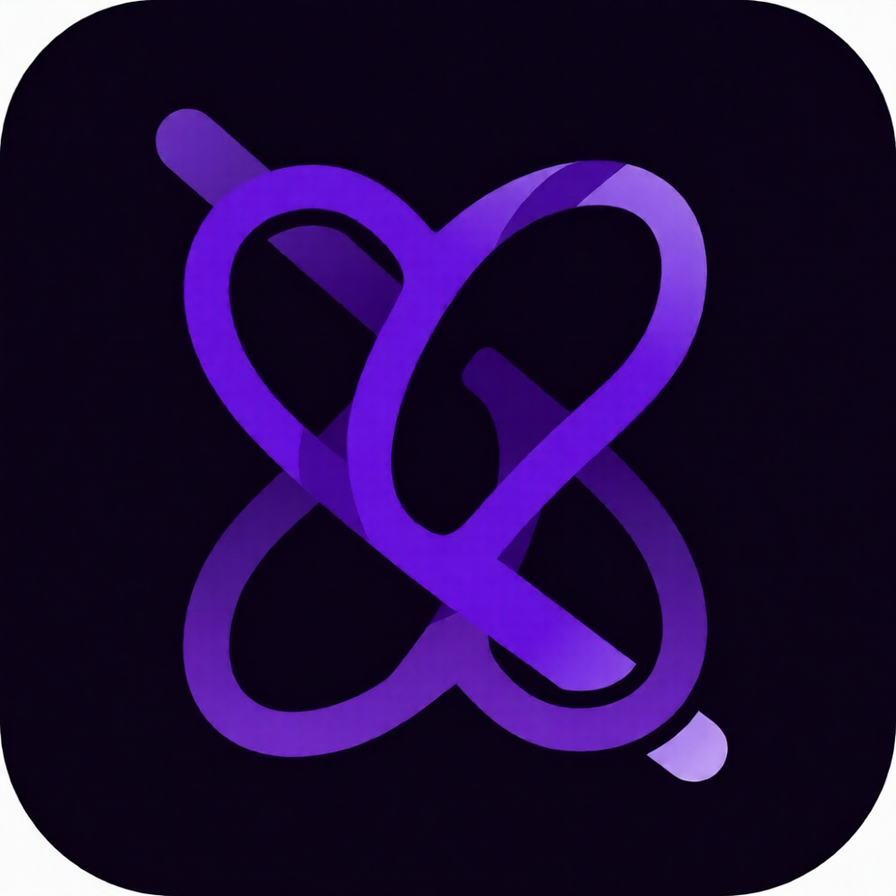

<div align="center">

  

  # My Presence

  **Show your Android activity as Rich Presence on Discord**

  <p>
    
    
    
    
    
  </p>

  <p>
    <a href="#features">Features</a> •
    <a href="#screenshots">Screenshots</a> •
    <a href="#build">Build</a> •
    <a href="#tech-stack">Tech Stack</a> •
    <a href="#license">License</a>
  </p>

  <br>

</div>

---

My Presence bridges the gap between your phone and Discord — it detects what app you're using and broadcasts it as a Rich Presence activity, so your friends can see what you're up to. Built from the ground up with **Kotlin**, **Jetpack Compose**, and the **Discord Gateway API**.

## Features

| | |
|---|---|
| **Auto App Detection** | Detects the currently running app using Android's `UsageStatsManager` — no manual selection needed |
| **Custom Rich Presence** | Full presence editor with timestamps, party size, buttons, images, and status |
| **Custom Presets** | Save and reuse your favorite presence configurations |
| **Gateway Connection** | Direct WebSocket connection to Discord Gateway v10 for real-time updates |
| **Google Sign-In** | Optional sign-in for backup & sync (Firebase) |
| **Persistent Service** | Foreground service keeps your presence alive even when the app is in the background |
| **Dark Theme** | OLED-friendly dark UI inspired by Discord's design language |
| **Battery Optimized** | Requests battery optimization exemption for reliable background operation |

## Screenshots

<div align="center">
  <table>
    <tr>
      <td></td>
      <td></td>
      <td></td>
    </tr>
    <tr align="center">
      <td>Dashboard</td>
      <td>Presence Editor</td>
      <td>Profile</td>
    </tr>
  </table>
</div>

> Screenshots coming soon — build the project to see it in action!

## Build

### Prerequisites

- Android Studio Ladybug (2024.2) or newer
- JDK 17+
- A [Discord Application](https://discord.com/developers/applications) with a client ID
- *(Optional)* Firebase project for Google Sign-In & analytics

### Setup

```bash
# Clone the repo
git clone https://github.com/Legendscene/mypresence.git
cd mypresence

# Create secrets.properties in the project root
cat > secrets.properties << EOF
DISCORD_CLIENT_ID=your_discord_client_id
GOOGLE_WEB_CLIENT_ID=your_google_client_id
DISCORD_BOT_TOKEN=your_bot_token
IMGUR_CLIENT_ID=your_imgur_client_id
EOF
```

Open the project in Android Studio and run on a device (API 26+).  
The app will guide you through the required permissions on first launch.

### Configuration

| Property | Required | Description |
|---|---|---|
| `DISCORD_CLIENT_ID` | Yes | Your Discord app's client ID |
| `DISCORD_BOT_TOKEN` | No | Bot token for gateway auth (falls back to user token) |
| `GOOGLE_WEB_CLIENT_ID` | No | Google Sign-In Web client ID |
| `IMGUR_CLIENT_ID` | No | Imgur client ID for image uploads |

## Tech Stack

| | |
|---|---|
| **Language** | Kotlin 100% |
| **UI** | Jetpack Compose + Material 3 |
| **DI** | Hilt (dagger) |
| **Networking** | Ktor Client (OkHttp engine) |
| **Serialization** | Kotlinx Serialization |
| **Image Loading** | Coil 3 |
| **Gateway** | Discord Gateway v10 (WebSocket) |
| **Auth** | Discord OAuth2 + Google Sign-In |
| **Backend** | Firebase Auth + Firestore |
| **Storage** | DataStore Preferences + Room |
| **Background** | Foreground Service + WorkManager |

## Architecture

```
com.kyrx.mypresence
├── core/           — DI, gateway engine, analytics, auth
├── data/           — API clients, repositories, gateway impl
├── domain/         — Use cases, models, repository interfaces
├── feature/        — Screens (dashboard, auth, settings, etc.)
├── service/        — Foreground presence service
└── ui/             — Components, theme, navigation
```

Clean Architecture with unidirectional data flow: **Screen → ViewModel → UseCase → Repository → DataSource**

## License

```
MIT License

Copyright (c) 2025 KyRx

Permission is hereby granted, free of charge, to any person obtaining a copy
of this software and associated documentation files (the "Software"), to deal
in the Software without restriction...
```

---

<div align="center">
  <sub>Built with ❤ using Kotlin & Jetpack Compose</sub>
  <br>
  <sub>Discord is a trademark of Discord Inc. This project is not affiliated with Discord Inc.</sub>
</div>
